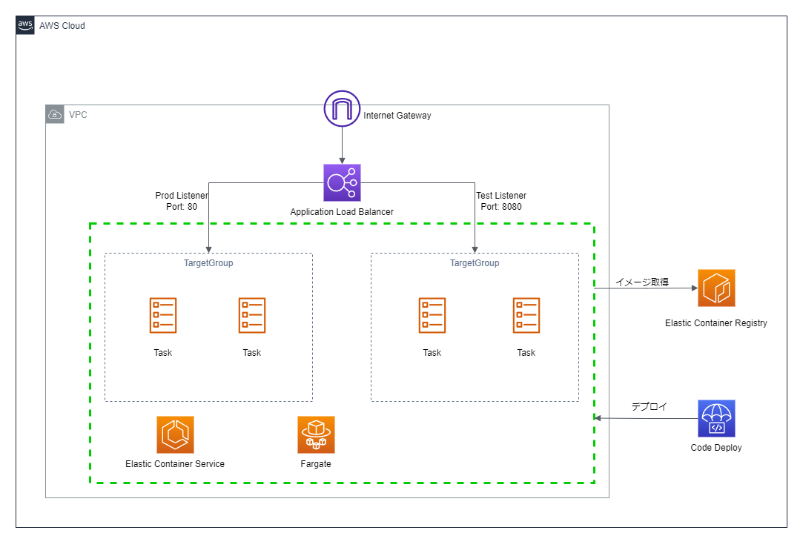
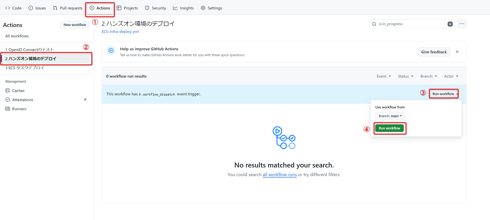

# リソースのデプロイ

GitHub Actionsを使って今回使用するリソースを作成します。  
下記構成が作成されます。  


## デプロイ用のポリシーの追加

ワークフローを実行するための権限をIAMロールに付与します。  
初めにIAMポリシーを作成します。

### IAMポリシーの作成

ポリシーは`AWS/iam_policy/cfn_deploy_policy.json`に用意しています。
このファイルを使用してポリシーを作成します。

```bash
aws iam create-policy --policy-name cfn-deploy-policy --policy-document file://AWS/iam_policy/cfn_deploy_policy.json
```

### IAMロールへアタッチ

続いて上記で作成したポリシーを`github-actions-role`にアタッチします。

```bash
aws iam attach-role-policy --role-name github-actions-role --policy-arn arn:aws:iam::${AWS_ID}:policy/cfn-deploy-policy
```

## GitHub Actionsを流す

ロールの作成が完了したら、GitHub Actionsを実行します。

今回は`2 ハンズオン環境のデプロイ`というワークフローを使用します。  
先ほどと同じように、ワークフローを選択し`Run workflow`からワークフローを実行してください。


成功したら、ALBのDNSにHTTPでアクセスして、**Welcome to nginx!**が表示されることを確認してください。
各種リソースも確認してみてください。

## 手順一覧

1. [開発環境の準備](./document/10_開発環境の準備/environment_preparation.md)
2. [OIDCの設定](./document/20_OIDCの設定/setting_OIDC.md)
3. [リソースのデプロイ](./document/30_リソースのデプロイ/deploy_resource.md)
4. [**ECSへのコンテナデプロイ**](./document/40_ECSへのコンテナデプロイ/deploy_container.md)←次の手順です
5. [セキュリティの実装](./document/50_セキュリティの実装/security_scan.md)
6. [リソースの削除](./document/60_リソースの削除/delete_resource.md)
